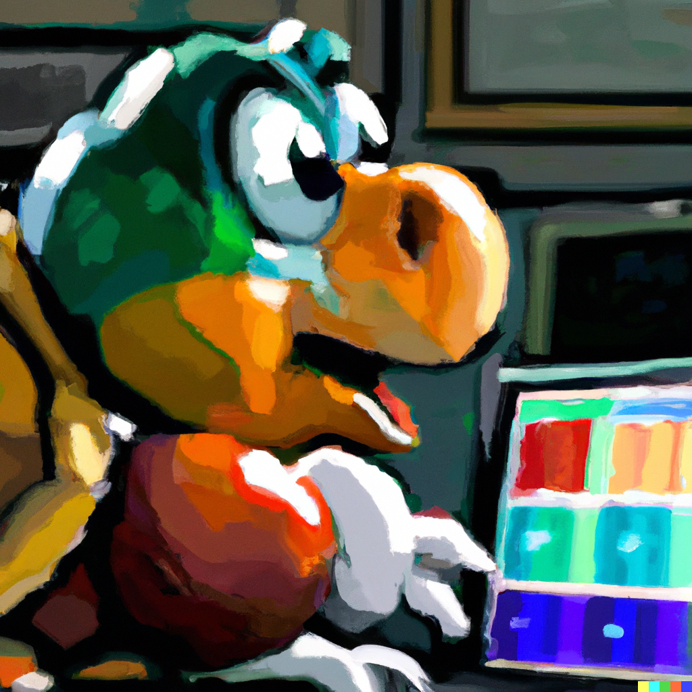

# Koopa

Keenly optimized obliging picture analysis - Koopa is a luigi-pipeline based workflow to analyze cellular microscopy data of varying types. Koopa is specialized on single particle analyses.

## Documentation

[Link to google doc](https://docs.google.com/document/d/1kG5cSCOSq7G8-0FeRhn2wSetVkI2d8sgFogwSKiE03Y/edit?usp=sharing).

## TODOs

* [ ] Add alignment for multiple channels
* [ ] Add option for custom cellpose model
* [ ] Add nicer config file support (multi-line break)
* [x] Create more thorough documentation on key components (rerunning, 0-indexing, etc.)
* [x] Add some integration tests
  * [ ] FISH 3D - with proper data once available
  * [x] FISH 2D - subset of specles
  * [x] Live cell - subset of smonster
  * [x] Flies 3D
